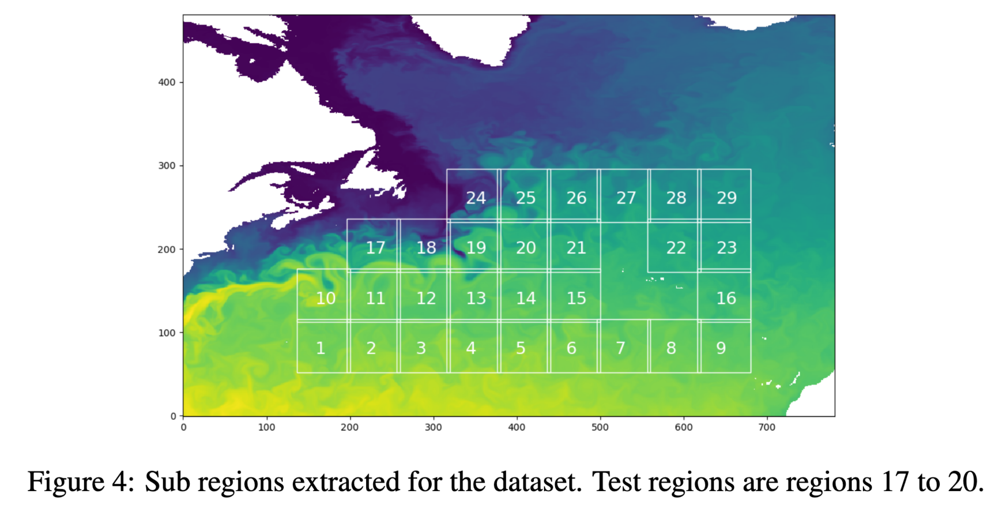
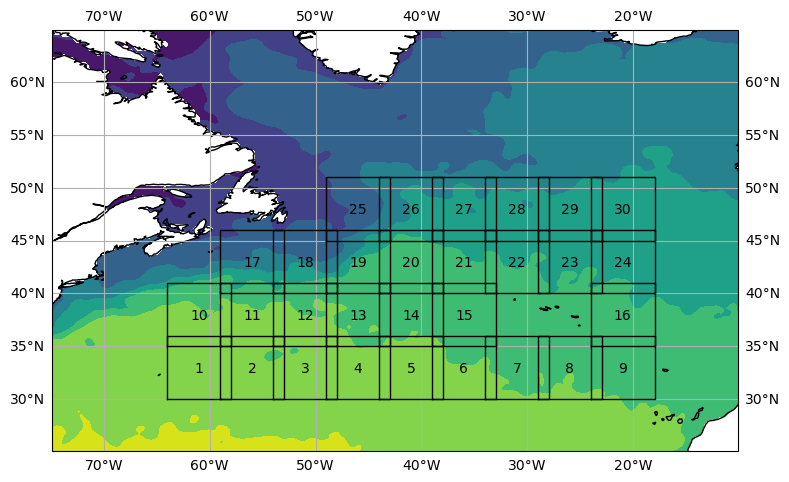

# Future SST prediction using Diffusion Models
## Dependencies

This project uses both Conda and Poetry to manage dependencies.
To install dependencies for the project, make sure that you have conda installed.

First, create virtual environment managed by conda:

> conda create -f environment.yml

This will create an environment named `sst`.
Then, you need to activate this environment and install other dependencies:

> conda activate sst

> poetry install

## Run Notebooks

To run notebooks on Carbonate's or Bigred200's GPU nodes,
you have to request for a gpu node using `slurm`.
Once the resource is allocated,
you can use the scripts in `scripts/ws` to start jupyter server on the node:

> scripts/ws/carbonate.sh <login_node> <jupyter_server_port>

## Dataset

The project will use Sea Surface Temperature data from [NOAA](https://psl.noaa.gov/data/gridded/data.noaa.oisst.v2.highres.html).

To download the data, just run this script:

> scripts/download_noaa_oi_sst_v2.py

~But the dataset downloaded has resolution of .25deg x .25deg,
which is too detailed for our purpose.
So, we will downscale it to 1deg x 1deg by running the script:~
On a second thought, we don't need to do this!

> scripts/downscale_noaa_ai_sst.py

Next, we will have to extract 29 patches as described in the [paper](https://arxiv.org/abs/1711.07970),
which is:

In order to do this, I have guessed the positions of these patches.
Of course, my guesses are not exactly the same
(you can look into the notebook `experiments/guess_patches_location.py`),
but I think it will be good enough.
One more thing, my guesses have 30 patches instead of just 29.
Specifically, here is the 30 guessed patches:

In order to extract the patches, just run the command
and it will extract all the patches to `NOAA/OI_SST_v2_patches/` folder.

> scripts/extract_sst_patches.py

Finally, the dataset can be loaded as pytorch dataset using the class
`sst.dataset.NOAA_OI_SST`.

## References

* de Bezenac, E., Pajot, A., & Gallinari, P. (2017).
Deep Learning for Physical Processes: Incorporating Prior Scientific Knowledge.
http://arxiv.org/abs/1711.07970
* Ho, J., Jain, A., & Abbeel, P. (2020).
Denoising Diffusion Probabilistic Models.
http://arxiv.org/abs/2006.11239
* Saharia, C., Ho, J., Chan, W., Salimans, T., Fleet, D. J., & Norouzi, M. (2022).
Image Super-Resolution Via Iterative Refinement.
IEEE Transactions on Pattern Analysis and Machine Intelligence, 1–14.
https://doi.org/10.1109/TPAMI.2022.3204461
* Weng, Lilian. (Jul 2021).
What are diffusion models? Lil’Log.
https://lilianweng.github.io/posts/2021-07-11-diffusion-models/.
